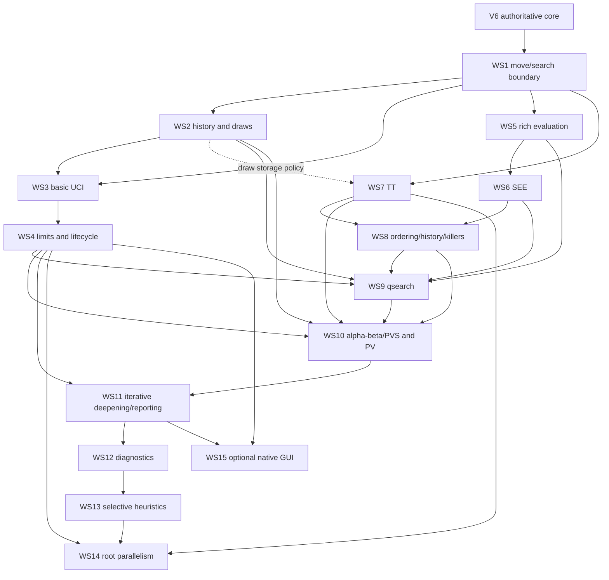

# SeedV3 → SeedV6 Feature Transplant Discovery

> Discovery baseline: 2026-09-02 (Pacific/Auckland). This is an observational architecture and programme report, not an implementation log or governance artifact. Paths beginning `V3/` are relative to `C:/projects/seed/java/seedv3/`; paths beginning `V6/` are relative to `C:/projects/seed/java/seedv6/`. Line references describe the inspected working trees and may move in later commits.

## 1. Executive verdict

SeedV3 is a playable but basic engine application. It has two startup modes (synchronous UCI or a native Swing GUI), legal game-state transitions, a feature-rich evaluation, root-parallel iterative search, alpha-beta/PVS-style negamax, quiescence, transposition storage, move ordering, history and killer heuristics, repetition handling, PV construction, diagnostics, and final best-move reporting. Its UCI surface is deliberately small: it can accept positions and fixed-depth searches, but does not implement usable `stop`, clock-based time management, or asynchronous command handling. “Playable” must not be read as “correct”: this discovery found several confirmed source-level defects, most importantly an in-check quiescence defect, faulty repetition semantics, and white-promotion parsing with the wrong colour.

SeedV6 has a substantially better low-level chess core and perft platform, plus a small fixed-depth search skeleton. Its production path uses direct legal staged generation, PEXT-based sliding attacks, reusable board/move buffers, and `Board.makeMoveInto`. It also has a separately exercised move-type experiment. It does **not** presently expose an engine protocol, accept an externally supplied position, manage an engine search lifecycle, or perform a competitive search. `V6/.../Main.java:6` only prints `Hello world!`; the only search driver is the hard-coded `tools/SearchSmoke` utility. The complete-engine path therefore stops before position intake and, independently, at `search/flat/FlatNegamax`, which is full-width fixed-depth negamax with material evaluation rather than a complete engine search.

The transplant is feasible, but it is an architectural adaptation rather than a file copy. SeedV6's board, status, move encoding, direct legal generator, check/pin/attack machinery, PEXT implementation, make/unmake strategy, perft tools, and associated tests remain authoritative. Donor high-level ideas should be separated into narrow V6-native services and joined through the existing `SearchRequest` / `SearchResult` / `SearchObserver` direction. No compatibility layer should recreate V3 pseudo-legal generation or allocating board transitions.

This report recommends **15 workstreams**. The first three form the shortest dependency-correct playable milestone: (1) stabilize the V6 move/search boundary, (2) add correct game history and draw adjudication, and (3) add a basic UCI shell with legal position replay and fixed-depth search. That milestone can accept normal UCI commands, receive a position, return a legal move, and play through an ordinary GUI. WS4 adds the lifecycle and time-control behaviour needed for robust timed games. WS5–WS14 build the complete search feature set in independently auditable layers. WS15 ports the optional native Swing frontend for SeedV3 user-interface parity.

The recommended policy is: preserve a simple exact V6 search as an oracle; establish protocol and lifecycle boundaries early; port correctness-bearing state before search heuristics; introduce evaluation, SEE, TT, ordering, qsearch, and main alpha-beta separately; and postpone parallelism and speculative pruning until the single-threaded search is stable and observable.

## 2. Repository baselines

### SeedV3 donor

- Branch: `main`, tracking `origin/main`.
- HEAD: `043214707df0f59b03f553fbf03983d9bb92b4d1` (`0432147`), commit subject `Continue work on optimizing search and see`, commit time `2026-06-09T14:49:28+12:00`.
- Inspected footprint: 36 production Java files (approximately 9,658 lines), 3 test Java files (approximately 300 lines), and 15 resources.
- Pre-existing working-tree modifications, not made or altered by this discovery:
  - `app/src/main/java/com/ohinteractive/seedv3/impl/Eval.java`
  - `app/src/main/java/com/ohinteractive/seedv3/impl/Gen.java`
  - `app/src/main/java/com/ohinteractive/seedv3/util/Perft.java`
- Material baseline caution: the committed `Eval.java` loads `KNIGHT_PAWN` from the `ROOK_PAWN` criterion. The pre-existing donor worktree corrects that load. `Gen.java` increases a move buffer from 100 to 128; `Perft.java` contains local diagnostic changes. Any later behavioural comparison must record whether it uses donor HEAD or the inspected dirty working tree.

### SeedV6 destination

- Branch: `main`, tracking `origin/main`.
- HEAD: `306a80f62a6949c86fda7ccebb7aa95963dfbd06` (`306a80f`), commit subject `Reorganize Perft positions`.
- Inspected footprint: 33 production Java files (approximately 7,667 lines), 4 test Java files (approximately 946 lines), and no resource files.
- Pre-existing working-tree modification, not made or altered by this discovery:
  - `app/src/main/java/com/ohinteractive/seedv6/tools/perft/Perft.java` (local CPU cap changed from `MAX_CPUS` to `1`).
- The requested discovery report did not exist at the start of this task.

Both repositories are Gradle Java 21 applications. No build or test command was run during this discovery: source and test inspection supplied the necessary evidence without risking generated repository artifacts. Existing test coverage is described in Sections 5 and 13; it must not be confused with tests executed in this task.

## 3. SeedV3 working-engine execution path

### 3.1 Startup and protocol selection

`V3/app/src/main/java/com/ohinteractive/seedv3/Main.java:10-16` selects the mode. An exact first argument of `uci` constructs `uci/Uci` and calls `run`; otherwise startup is handed to Swing and `gui/ChessGUI`.

`Uci.run` (`uci/Uci.java:22`) owns a `Scanner` loop and dispatches commands synchronously. It implements:

- `uci`, returning identity and `uciok`;
- `isready`, returning `readyok`;
- `ucinewgame`, resetting board/history state;
- a set of implementation-specific diagnostics toggles;
- `position startpos ...` and `position fen ...`;
- `go`, from which only `depth` is materially parsed (default depth 4);
- `quit` outside an active search; and
- a syntactic `stop` branch with no effective stop mechanism.

Because `go` invokes search on the command-reading thread, the loop cannot read `stop` or `quit` while that search is running. The EOF case also does not break the outer loop. Thus this is sufficient for basic fixed-depth GUI use, but it is not a complete UCI lifecycle.

### 3.2 Position intake and move replay

`Uci` creates a board with `util/Fen`, and `applyMoves` turns coordinate strings into donor-encoded moves using `util/Move.stringToInt`. Each result is passed directly to `impl/Board.makeMove`, after which the resulting Zobrist key is appended to `util/History`. The parser does not resolve the text against the position's generated legal moves. This is a significant coupling and correctness boundary: parser-chosen flags, piece identity, promotion identity, castling and en-passant semantics can reach board mutation without legal-move confirmation.

The GUI takes the safer route. `gui/BoardCanvas`/`ChessGUI` generate current legal moves using `impl/Gen`, identify a move by source/destination, and apply the matching generated encoding. Both UCI and GUI then use the same board/search components.

### 3.3 Root search orchestration

`search/Search.java` is the root controller:

1. Its constructor creates a 192 MB `util/TTable`, evaluates the root with `impl/Eval`, obtains legal root moves from `impl/Gen`, and allocates a fixed thread pool sized from available processors.
2. `Search.run` (`Search.java:75`) iterates configured depths. Root moves are ordered by retained results from the preceding iteration.
3. For every root move it creates the child with the allocating V3 `Board.makeMove`, copies history, and submits a `search/SearchTask`.
4. Each `SearchTask` owns a private `MoveOrdering` and `NegamaxSearcher`, but shares the root TT. It searches its already-applied child board and returns an `EvalResult` containing score, node information, and PV.
5. `Search` collects futures in completion order, embeds the returned score into the upper bits of its root-move value, preserves the best result, and reports through `SearchReporter` (`ConsoleReporter` for console output).
6. `Uci` emits a final `info depth ... score cp ... pv ...` and then `bestmove` (`Uci.java:179`). Mate values are not converted to UCI `score mate` form.

The applied child is passed to the task with the requested iteration depth unchanged. Unless the donor intentionally defines depth below the root, this is an apparent one-ply reporting mismatch and must be audited rather than inherited.

### 3.4 Recursive search path

`search/NegamaxSearcher.java` contains the donor's high-level engine search. The normal path includes:

- fail-soft negamax/alpha-beta with principal-variation-style null-window searches and re-searches;
- optional MTD(f) entry, aspiration at root-task level, and mate-distance bounds;
- check extension;
- TT probe, bound use, hash move and store with mate-score normalization;
- repetition adjudication through `History`;
- reverse futility, null-move pruning, a depth-one qsearch shortcut/razoring-style path, futility pruning, internal iterative deepening, multi-prob-cut, and late-move reduction;
- donor legal move generation, move scoring/order, killer moves, and history updates;
- terminal mate/stalemate evaluation; and
- PV propagation through per-ply arrays.

This is real, actively invoked engine code, not a collection inferred from class names: `SearchTask.call` constructs and calls `NegamaxSearcher`; `Search` consumes the returned score/PV; both UCI and GUI consume `Search`'s selected root move.

The TT and heuristics have hidden state worth preserving only conceptually: `TTable` owns shared direct-mapped entry storage and stripe locks; `MoveOrdering` owns killer/history arrays; `NegamaxSearcher` owns fixed-size search/PV/reduction structures; diagnostics pass through a large `SearchDiagnostics` object; and the root executor makes TT writes concurrent while heuristics remain task-private.

### 3.5 Quiescence and evaluation

Quiescence is an iterative frame machine inside `NegamaxSearcher`. It performs stand-pat evaluation, capture generation, delta pruning, and configurable SEE gates to a maximum donor q-depth. However, at `NegamaxSearcher.java:386` stand pat is evaluated before check state is established, and at line 395 the move set is always `generateCaptures`; quiet legal evasions are never generated. This is a confirmed source-level design error for in-check qnodes, not an implementation to copy.

`impl/Eval` is much richer than V6's evaluator. It combines phase interpolation, material and piece-square terms, mobility, king safety, pawn shields/storms, doubled/weak/isolated/passed/phalanx/unstop pawn features, rook file/pair/development terms, minor-piece outposts/protectors, distances, bishop-pair logic, and resource-loaded criteria/bonuses. It also exposes move-aware SEE and a legacy passive SEE. Evaluation is side-to-move relative. It owns a static evaluation `TTable`, while `drawEval` mixes 50-move and insufficient-material rules into a score which can be stored/retrieved by a key that does not encode the halfmove clock. That cache/rule coupling is unsafe and must be removed during adaptation.

### 3.6 Frontend and lifecycle completion

`gui/ChessGUI` supplies a human board, engine-vs-human/self-play controls, resources, and background search. It searches successively at depths 2, 4, ... 12 and applies the selected move. It is actively usable, but it does not guard the no-legal-root-move result before applying it and therefore needs a terminal-state fix if ported. The unused `uci/UciHandler` is an incomplete skeleton and is not part of the verified runtime path. Likewise, `unused/TestPositions` is not an engine dependency.

## 4. Current SeedV6 execution path

### 4.1 Entry point and reachable search

`V6/app/src/main/java/com/ohinteractive/seedv6/Main.java:3-7` has no engine lifecycle and only prints `Hello world!`. There is no UCI package, no GUI package, and no normal route from input to search.

The only executable search demonstration is `tools/SearchSmoke.java`. It constructs a hard-coded starting board, creates a fixed-depth `search/common/SearchRequest`, registers a `SearchObserver`, calls `search/flat/FlatNegamax`, and prints the returned fields. It cannot receive a GUI position or participate in a game.

### 4.2 Existing search boundary

`search/common/SearchRequest`, `SearchResult`, and `SearchObserver` are a useful intentional beginning:

- the request carries a board and depth;
- the result has best move, `hasMove`, score, depth, nodes, legal root count, and `completed`; and
- the observer is an integration seam for search progress.

They are **partial**, not complete contracts. There are no clock/node/movetime/infinite limits, cancellation token, lifecycle state, PV, mate reporting, iteration snapshots, or reason for termination. `SearchResult.completed` is declared (`SearchResult.java:11`) but the inspected `FlatNegamax` never assigns it, so even its current completion contract is not functioning.

### 4.3 Fixed-depth baseline search

`FlatNegamax` is a non-recursive, preallocated frame-stack search. For each node it:

1. gets current checkers;
2. uses `Gen.genEvasion` when checked (`FlatNegamax.java:125`);
3. otherwise generates tactical moves and then quiet moves (`:129`, `:137`);
4. applies a move into a reusable child buffer with `Board.makeMoveInto` (`:94`);
5. searches every child at full width; and
6. evaluates leaves with V6's material evaluator.

It correctly demonstrates how a V6 search should consume staged direct-legal generation and reusable board storage. It also returns mate (`-32768 + ply`) versus stalemate (0) when there are no legal moves. It does not provide alpha-beta, qsearch, TT, ordering inside stages, repetition/50-move adjudication, iterative deepening, PV, selective search, time/stop control, or parallelism. It should be retained or refactored into a shallow exact oracle rather than overwritten wholesale.

### 4.4 Authoritative V6 mechanics

The production `core/Board` and `core/Gen` operate on four piece bitplanes plus packed status/key data. `Board.makeMoveInto` (`Board.java:135`) writes the next state into caller-provided storage. `Gen` calculates checks, response masks, pins, king legality, special-move legality and direct legal moves; it separates evasions, tactical moves and quiet moves. Sliding attacks in generation use `core/util/Pext`. The boolean `legal` and some scratch/key arguments in the current generation signatures are not evidence of a V3-style pseudo-legal mode: inspection shows generation remains direct-legal and those parameters are currently unused in the relevant implementation. Ported callers must not rely on `legal=false` to recreate donor semantics.

The repository also contains `core/BoardMoveType` and `core/GenMoveType`, which attach explicit move-type and castling-change metadata to an alternative move encoding. They are exercised by `MoveTypeExperimentTest`, move-type perft variants, and `MoveTypeBenchmark`, whereas `FlatNegamax` and `SearchSmoke` use the production `Board`/`Gen`. This is a V6-owned architecture decision still in motion. A search integration boundary must make that choice explicit or encapsulate it; importing V3's encoding would make the uncertainty worse.

V6's `core/Eval` is intentionally small: material, a bishop-pair term, and limited insufficient-material handling. It is adequate for the smoke search but not SeedV3 feature parity.

### 4.5 Where the complete path stops

There are two distinct gaps:

- **Application gap:** `Main` never creates an engine, parses UCI, receives a FEN/move list, or invokes `FlatNegamax`.
- **Engine gap:** `FlatNegamax` proves legal traversal but has none of the state, control, evaluation, search, reporting, or concurrency layers required for a useful playing engine.

Consequently SeedV6 is a fast legal-move/perft platform with a search scaffold, not yet a playable engine. It can be made minimally playable without waiting for every advanced search feature, provided protocol position replay only accepts moves resolved from V6's generated legal list.

## 5. Capability comparison

| Subsystem | SeedV3 evidence/status | SeedV6 evidence/status | Classification | Transplant needed? | Important notes |
|---|---|---|---|---|---|
| Application entry | `Main` selects UCI or Swing | `Main` prints greeting | ABSENT | Yes | Add a V6 engine entry/lifecycle; do not copy donor global state blindly. |
| UCI identity/readiness | Active in `Uci.run` | None | ABSENT | Yes | Basic shell is an early playable-path dependency. |
| UCI position/FEN intake | `Uci` + `Fen`, but move replay is unchecked | `Fen` can build board; no command intake or move parser | PARTIAL | Yes | Resolve coordinate text against generated V6 legal moves. |
| UCI `go depth` | Synchronous fixed-depth invocation | Search request has depth but no UCI route | PARTIAL | Yes | Early integration can expose V6 baseline search. |
| UCI clocks/limits/stop | Clocks ignored; `stop` ineffective | None | ABSENT | Yes, new V6 design | Donor is reference only for command names, not lifecycle behaviour. |
| Native Swing GUI | Active `ChessGUI`/`BoardCanvas` and resources | None | ABSENT | Optional | Not required for an ordinary external UCI GUI; port last if desired. |
| Engine service/lifecycle | Embedded synchronously in UCI; GUI has its own executor | No service; `SearchSmoke` direct call | PARTIAL | Yes | One service should serve UCI and any future native GUI. |
| Board representation/status | Six-long encoded board/status/key | Four bitplanes plus packed status/key | PRESENT BUT DIFFERENT | No | V6 is authoritative. Higher layers adapt upward. |
| Move representation | Donor bit encoding plus score bits and parser | V6 long encoding; separate move-type experiment | PRESENT BUT DIFFERENT | No | Do not copy constants/bit tests. Establish an opaque move boundary. |
| Move text output | `Move.intToString`/notation | `core/move/Move` string/notation exists | PARTIAL | Small adaptation | Coordinate output exists; input/legal resolution does not. V6 notation has a suspected stale-status defect. |
| Move generation | Pseudo-legal generation followed by purge/filter | Direct legal staged PEXT generation | PRESENT BUT DIFFERENT | No | V6 replacement is superior and authoritative. |
| Check/evasion/pin legality | Derived through donor attacks and legality purge | Native checker, response-mask, pin and direct evasion logic | PRESENT BUT DIFFERENT | No | Search must use `genEvasion` when checked. |
| Attack generation | Magic/bitboard donor helpers | PEXT plus V6 attack helpers | PRESENT BUT DIFFERENT | No | Keep PEXT/core; adapt eval/SEE to it. |
| Move application | Allocating `Board.makeMove`/null move | Buffer-oriented `makeMoveInto`/`nullMoveInto` | PRESENT BUT DIFFERENT | No | Search needs per-ply buffers, not donor allocations. |
| FEN/Zobrist/piece utilities | Complete for donor encoding | Complete for V6 encoding | PRESENT BUT DIFFERENT | No | Reuse V6 semantics; audit EP/repetition details at integration. |
| Perft tooling | Main-style donor tool, currently locally modified | Multiple recursive/flat/parallel/typed variants and position library | PRESENT BUT DIFFERENT | No | V6 is stronger; keep as regression guard. |
| Low-level tests | Limited `GenTest` plus SEE test | Board, PEXT, move-type and perft-library tests | PRESENT BUT DIFFERENT | No | V6 tests are core authority, though no tests were run here. |
| Fixed-depth exact search | Donor search is much more advanced | `FlatNegamax` full-width fixed-depth traversal | PARTIAL | Extend, preserve oracle | Use as boundary proof and shallow correctness oracle. |
| Static evaluation | Rich active `Eval` plus resources/cache | Material/bishop-pair minimal eval | PARTIAL | Yes | Port features, not cache/rule coupling. |
| Static exchange evaluation | `Eval.seeMove`, actively used/tested; legacy SEE also present | None | ABSENT | Yes | Adapt to V6 move/attack semantics after eval primitives. |
| Repetition history | Active `History`, but global-flag semantics are wrong | None | ABSENT | Yes, correctness redesign | Must track current-line/current-position occurrences and seed roots correctly. |
| 50-move/dead-position draw | In donor `Eval.drawEval`, with cache hazard | Narrow insufficient-material handling only | PARTIAL | Yes | Rule adjudication belongs in search/game state, not positional cache. |
| Transposition table | Shared 192 MB `TTable`, active in search/eval | None | ABSENT | Yes | Port contract, not object-heavy/direct-mapped implementation by default. |
| Move ordering | Hash/captures/SEE/killers/history through `MoveOrdering` and `Sort` | Tactical-before-quiet staging only | PARTIAL | Yes | Exploit V6 stages; do not reuse donor threshold sort capacity assumptions. |
| History heuristic | Active task-private arrays/maps | None | ABSENT | Yes | V6-native indices, saturation/decay and reset policy needed. |
| Killer heuristic | Active per-task/per-ply state | None | ABSENT | Yes | Introduce with move ordering. |
| Quiescence | Active capture qsearch, but incorrect in check | None | ABSENT | Yes, corrected design | Stand pat only outside check; generate every legal evasion in check. |
| Alpha-beta/PVS | Active in `NegamaxSearcher` | Full-width negamax only | PARTIAL | Yes | Introduce after TT/order/qsearch contracts exist. |
| PV handling | Active per-ply arrays; can truncate on TT cutoff | None in result | ABSENT | Yes | V6-owned PV and hash-line policy; every reported move must be legal. |
| Iterative deepening | Active in root `Search` | None | ABSENT | Yes | Depends on cancellable search and stable result/PV contracts. |
| Aspiration/MTD(f) | Implemented/configurable | None | ABSENT | Selectively | Aspiration useful; MTD(f) should remain optional pending audit. |
| Search pruning/reductions | Check extension, RFP, null, futility, IID, MPC, LMR, mate distance | None | ABSENT | Yes, individually gated | Do not introduce until exact search and diagnostics are stable. |
| Root parallelism | One task per legal root move, shared TT | None | ABSENT | Later | Do not make it an early prerequisite; validate single-thread first. |
| Search limits/cancellation | No effective implementation | None | ABSENT | Yes, new design | Required before robust GUI/timed play. |
| Principal result/reporting | Final UCI info/bestmove and console reporter | `SearchResult`/observer skeleton; `completed` unset | PARTIAL | Yes | Strengthen before higher search layers to avoid integration churn. |
| Diagnostics | Extensive active optional counters/reporter output | Observer only | PARTIAL | Yes, after base search | Port useful measurements semantically; avoid a shared hot-path monolith. |
| Eval/search benchmarks | Perft and diagnostics, no stable search benchmark suite observed | Perft and move-type benchmark; `SearchSmoke` only | PARTIAL | Yes | Add deterministic search position suite and metrics in later streams. |
| Evaluation resources | Active property files via `Crit` | No resources | ABSENT | With evaluation | Validate completeness/ranges/failure behaviour during port. |
| Donor pseudo-legal purge | Required by V3 generator | Superseded by V6 direct legality | OBSOLETE DONOR MECHANISM | No | Never recreate just to ease a port. |
| Donor Magic attack core | Required by V3 board/gen/eval | Superseded by V6 PEXT/core | OBSOLETE DONOR MECHANISM | No | Translate feature queries to V6 attacks. |
| Donor allocating search boards | Used throughout search | Superseded by V6 reusable buffers | OBSOLETE DONOR MECHANISM | No | A V6 search stack should own its storage. |
| `UciHandler`/`unused/TestPositions` | Incomplete/unused | No counterpart | OBSOLETE DONOR MECHANISM | No | Not in verified runtime path. |

## 6. SeedV6 authoritative core — do not transplant

The following exclusions are programme boundaries, not optional optimizations:

1. **Board and state representation.** Keep `V6/core/Board`, its packed status/key conventions, and V6 FEN/Zobrist utilities. V3 higher layers may read equivalent facts only through V6 APIs or narrowly added accessors. Importing `V3/impl/Board` would split state authority and invalidate V6's tested transitions.
2. **Move encoding.** Keep the production V6 encoding or whichever V6-owned typed encoding is explicitly selected. Donor checks for capture, promotion, castling, source/destination or embedded score bits must be translated. A long-lived compatibility encoding would entangle every later layer.
3. **Move generation and legality.** Keep `V6/core/Gen.genEvasion/genTactical/genQuiet` and direct legal semantics. Do not import `V3/impl/Gen`, pseudo-legal lists, `purgeIllegalMoves`, or callers that expect “make then reject own king in check.”
4. **Attack generation.** Keep V6 PEXT/check/pin machinery (`core/util/Pext`, V6 `Board`/`Gen` helpers). Donor `Magic`, rays and attack masks are reference formulas only where an evaluation or SEE feature needs an equivalent query.
5. **State transition and null move.** Keep caller-owned V6 storage and `makeMoveInto`/`nullMoveInto`. Donor allocations may be convenient but would surrender one of V6's central mechanical advantages and distort the later search design.
6. **Perft and low-level regression assets.** V6 already has recursive and flat, serial/concurrent and move-type perft variants plus a shared position library and PEXT/equivalence tests. Donor perft code and its local debug edits add no authoritative capability.
7. **Core constants/helpers.** Do not wholesale copy V3 `Move`, `Piece`, `Value`, `Fen`, `Zobrist`, `Bitboard`, `Magic`, or `Sort`. Translate higher-level semantics against V6 definitions. In particular, V3 scores moves by packing data into the move value; a V6 move should remain opaque and sortable metadata should normally be sidecar state.
8. **The donor's UCI move constructor.** It can create unverified moves and encodes lowercase white-promotion letters as black pieces. V6 UCI replay must parse coordinates and promotion intent, generate legal moves, and select the exact matching V6 move.

Two V6 questions are deliberately left for V6 ownership rather than answered by transplanting donor code: whether production generation adopts `BoardMoveType`/`GenMoveType`, and whether some currently unused generator parameters should be removed or given meaning. WS1 must isolate search from this choice sufficiently that later work is not repeated.

## 7. Transplant candidate details

The candidates below are feature boundaries, not proposed file-copy sets. “Complete and active” describes donor reachability, not a guarantee of correctness. Complexity is relative to this programme.

### 7.1 WS1 — V6 move/search boundary and fixed-depth baseline

**Purpose.** Turn the existing smoke search into a trustworthy engine-facing baseline, establish opaque move/state contracts, and preserve an exact shallow oracle for later search validation.

**Donor implementation and use.** V3 demonstrates the necessary external concepts in `util/Move`, `impl/Gen`, `impl/Board`, `search/SearchConfig`, `SearchContext`, `SearchReporter`, `SearchTask` and `EvalResult`. They are active, but their mechanical APIs are specifically unsuitable for transplant.

**Destination state.** `search/common/SearchRequest`, `SearchResult`, and `SearchObserver` plus `search/flat/FlatNegamax` already provide a partial boundary. The result's `completed` field is not set, the request is only depth-based, there is no PV, and current code directly binds to production `Board`/`Gen` despite the parallel move-type experiment.

**Dependencies and integration surface.** Hard dependency only on the authoritative V6 core. It becomes the stable interface used by UCI, lifecycle, draw state, later alpha-beta, diagnostics and GUI. It must represent no-legal-move, terminal score, depth and completion unambiguously.

**V3 assumptions to remove.** Never depend on donor bit positions, scores packed into moves, pseudo-legal filtering, allocating board results or arbitrary text-to-move construction. A caller-supplied move is legal only after matching a generated V6 move.

**Required V6 adaptation.** Keep current production Board/Gen for the immediately executable path unless V6 maintainers explicitly promote the typed experiment. Put move formatting, coordinate matching, special-move queries and move application behind narrow V6-owned operations. Define depth relative to the root, node accounting, terminal/mate score convention, immutable request ownership, result completion, observer timing, and board non-mutation. Preserve `FlatNegamax` or an equivalent exact shallow mode.

**Correctness-audit focus.** Root-vs-child depth semantics; mate sign and distance; stalemate; empty-root handling; buffer capacity/offsets across tactical and quiet stages; generator state arguments; board array aliasing; result reuse; observer exceptions; `completed`; and legal matching for castling, en passant and both-colour promotions. Investigate `core/move/Move.notation`: after `makeMoveInto` at line 198 it generates from the child bitboards with the old `status` at lines 201–202.

**Likely validation.** Contract tests for depths 0/1 and terminal mate/stalemate; every legal move type round-tripped between generated move and coordinate text; illegal input rejection; result completion and no-root semantics; board immutability; deterministic shallow scores against a simple recursive V6 oracle; and the existing V6 perft suite as a low-level regression guard.

**Deferred optimization.** Do not optimize the baseline away. Later searches may replace frame shape or move metadata, but a small exact oracle is more valuable than micro-optimizing this workstream.

**Complexity / sequencing value.** Medium. It has the fewest high-level dependencies and prevents every later workstream from binding directly to an unsettled move encoding.

### 7.2 WS2 — Position history and draw adjudication

**Purpose.** Supply correct game/search-line history, threefold-repetition detection, 50-move handling, and an explicit insufficient/dead-position policy.

**Donor implementation and use.** `util/History` and `HistoryMap` are actively copied into each root task, pushed/popped by `NegamaxSearcher`, and queried at `NegamaxSearcher.java:219`. `impl/Eval.drawEval` handles the halfmove rule and a limited material draw. The feature is active but not logically sound as designed.

**Destination state.** V6 Board status carries move counters and Zobrist state; `core/Eval` has a narrow insufficient-material branch. No search-line repetition service exists.

**Dependencies and integration surface.** Depends on WS1 state/key access and V6 Zobrist semantics. It feeds UCI position replay, qsearch, alpha-beta, TT policy, root lifecycle and GUI. It should be independent of the evaluator and search algorithm.

**V3 assumptions to remove.** V3 sets one global `repetitionDetected` flag when *any* key reaches count three, then `isRepetition` reports that flag for unrelated current positions. It also omits the initial position and the current root candidate at important points. Do not copy the fixed 512-entry storage, generic open-addressed deletion behaviour, or the signed-byte generation markers that cannot compare equal to integer generations 128–255.

**Required V6 adaptation.** Maintain an ordered game-history prefix and per-search-line pushes/pops, with current-key occurrence queries. Seed the initial/current root correctly, define irreversible-move scanning or equivalent scope, separate claimable threefold from search adjudication policy, and decide mate-versus-50-move precedence consistently. Draw state dependent on the halfmove clock must never be hidden in a pure position-keyed eval cache.

**Correctness-audit focus.** Current position versus any historical position; occurrence counting including the root; twofold-in-line versus game threefold; push/pop balance on cutoffs/cancellation; null moves; Zobrist en-passant normalization; castling rights; copied versus shared state; 99/100 halfmove boundary; checkmate at a draw boundary; insufficient-material cases; and packed halfmove-counter capacity/wrap in the authoritative core.

**Likely validation.** Constructed repetition sequences with and without the initial position; a previous threefold followed by an unrelated branch; line push/pop restoration; FENs at halfmove 99/100; mate/stalemate precedence; known insufficient/non-insufficient material sets; and key-equivalence tests for en-passant states. Add focused unit tests because neither repository has verified coverage for this contract.

**Deferred optimization.** A compact reversible-window scan, key-count table, or incremental material signature can follow correctness. The first implementation should favour transparent state and assertions.

**Complexity / sequencing value.** Medium-high correctness risk. Introducing it before protocol and search means every consumer shares one correct definition instead of retrofitting draw semantics into cached evaluation or multiple searchers.

### 7.3 WS3 — Basic UCI engine shell and legal position replay

**Purpose.** Reach the minimum playable-engine milestone: identify over UCI, accept a position, perform a bounded fixed-depth search, and return a legal best move.

**Donor implementation and use.** `Main` and `uci/Uci` are the active donor route. `uci/UciHandler` is unused/incomplete and is excluded. The donor shell is feature-complete only for basic synchronous depth operation.

**Destination state.** V6 has FEN parsing, coordinate move output and the WS1 search boundary, but no input dispatcher or engine session.

**Dependencies and integration surface.** Requires WS1 and WS2. It becomes a thin client of an engine/search service so WS4 can make search asynchronous without rewriting position semantics. Later iterative reporting should plug into the observer boundary.

**V3 assumptions to remove.** Do not pass parser-manufactured moves to Board, assume promotion piece colour from a character table, retain a global repetition flag, or spin at EOF. Do not represent no move as an ordinary zero move that can be applied.

**Required V6 adaptation.** Route `Main` to UCI mode; implement `uci`, `isready`, `ucinewgame`, `position startpos`, `position fen`, legal move replay, `go depth`, `quit`, and correct `bestmove`/`bestmove 0000`. Parse each coordinate/promotion token into intent, generate V6 legal moves for the current board, select the unique exact match, and only then apply it and update history. Define malformed-command recovery without corrupting session state.

**Correctness-audit focus.** Tokenization of six-field FEN plus `moves`; transactional failure; start-position seeding; white and black promotions to q/r/b/n; castling and en passant; stale position/history after `ucinewgame`; mate/stalemate result syntax; score perspective; newline flushing; EOF/quit; unexpected commands; and UCI compliance of all stdout (diagnostics must not leak non-`info string` text).

**Likely validation.** Process-level scripted stdin/stdout transcripts for handshake, readiness, new game, startpos and FEN replay; every special move; malformed/illegal move rejection; a known one-move/mate position; legal `bestmove`; and `bestmove 0000` for terminal roots. A temporary deterministic depth setting is sufficient.

**Deferred optimization.** Avoid a sophisticated command framework or option system initially. Protocol correctness and separation from the search thread matter more than parser throughput.

**Complexity / sequencing value.** Medium. Placing it now makes SeedV6 usable early and supplies an end-to-end harness without coupling the protocol to the eventual advanced search.

### 7.4 WS4 — Search limits, cancellation, asynchronous lifecycle, and time management

**Purpose.** Let the engine receive commands while searching and support practical UCI limits: clocks/increments, `movetime`, `nodes`, `depth`, `infinite`, `stop`, replacement searches and shutdown.

**Donor implementation and use.** V3's GUI demonstrates background ownership, but UCI search is synchronous, clock tokens are ignored and `stop` is ineffective. This candidate is therefore a required new V6 system, not a transplant of a complete donor feature.

**Destination state.** No lifecycle or limit service exists. `SearchRequest` only carries depth; `SearchObserver` is a useful seam.

**Dependencies and integration surface.** Requires the WS1 contract and WS3 session boundary. Draw/history (WS2) travels with the request. Every later search loop and root worker must poll the same low-overhead cancellation/limit object. WS11 consumes the “last fully completed iteration” rule.

**V3 assumptions to remove.** Do not block command intake on `Search.run`, create unmanaged executors per search, or report a partially corrupted iteration as final. Do not conflate engine session state with mutable search-worker state.

**Required V6 adaptation.** Define engine-thread ownership, search generation IDs, idempotent cancellation, best-so-far publication, deadline/node checks, safe `stop`/`quit`/new-position behaviour and time allocation from `wtime/btime/winc/binc/movestogo`. Depth-only requests remain deterministic. Search must return a legal fallback when stopped before a full iteration if a legal root exists.

**Correctness-audit focus.** Races between completion and `stop`; stale results from a replaced search; visibility of cancel flags/results; deadline arithmetic/overflow; side-to-move clock selection; node-limit exactness; zero/negative limits; ponder/infinite policy; executor leaks; exception containment; double completion; quit latency; and observer calls after cancellation.

**Likely validation.** Fake-clock unit tests; deterministic node/depth limits; `go infinite` followed by `stop`; `quit` during search; back-to-back `position`/`go`; cancellation before first full depth; deadline overrun bounds; thread-leak checks; and process-level UCI smoke games under small clocks.

**Deferred optimization.** Sophisticated time allocation, pondering and adaptive overhead tuning can wait. Start with conservative, testable budgeting and cheap periodic polling.

**Complexity / sequencing value.** High. It follows the minimum milestone to minimize initial scope, but precedes advanced search so cancellation is not retrofitted into every recursive and qsearch path.

### 7.5 WS5 — Rich phase-aware static evaluation

**Purpose.** Port the donor's playing-strength evaluation features onto V6 board/attack primitives while keeping rule adjudication and caching separate.

**Donor implementation and use.** `impl/Eval`, `util/Crit`, `util/Value` and property resources implement and actively supply root, main-search and qsearch scores. Features include tapered phase/material, PSQT, mobility, king safety, pawn structure/passed-pawn logic, rook and minor-piece structure, distances and bishop-pair terms. `evalWithLogging` is a duplicate diagnostic implementation rather than the active production route.

**Destination state.** `core/Eval` provides material, bishop pair and narrow insufficient material only. PEXT/core already expose many mechanical queries needed to compute donor concepts.

**Dependencies and integration surface.** Requires only WS1/core access; it can be tested independently. It supplies SEE piece values (not necessarily its algorithm), qsearch stand pat, alpha-beta leaves and diagnostics. Rule draws remain in WS2.

**V3 assumptions to remove.** Translate every donor piece/status/mask/side-to-move operation. Do not import donor Magic, board arrays, mutable static logging state, or the static eval `TTable`. Do not cache halfmove-dependent `drawEval` under a Zobrist key which omits that counter.

**Required V6 adaptation.** Decide whether property resources remain the source of tunables or become validated immutable V6 data; map all features to V6 PEXT/attack/accessor APIs; keep side-to-move score convention explicit; make initialization failures fatal or explicit rather than silently leaving zero arrays; and implement one production calculation with optional instrumentation rather than two divergent copies.

**Correctness-audit focus.** Every resource key/table length; the committed donor `KNIGHT_PAWN`/`ROOK_PAWN` load error versus the pre-existing worktree fix; phase boundaries; black-square mirroring; sign/perspective; king existence assumptions; pawn shifts at board edges; passed/outpost masks; mobility exclusions; bishop colour logic; overflow; board mutation; and duplicate logging parity. `evalWithLogging` uses a bishop-colour draw predicate opposite to production `drawEval`, so neither should be treated as an unquestioned oracle.

**Likely validation.** Feature-isolation positions, colour-flip/mirror symmetry, material ladders and endgames; donor-versus-destination corpus comparisons with the exact donor baseline recorded; production versus instrumented equality; resource completeness tests; random legal-position no-mutation/range checks; and strength smoke tests only after deterministic correctness tests.

**Deferred optimization.** Pawn/eval hashes, incremental evaluation, SIMD/bit tricks and retuning should wait. A future cache must define which state its key covers.

**Complexity / sequencing value.** High but independently testable. Introducing eval before qsearch/main search gives those workstreams a stable scoring contract and avoids debugging search and feature translation together.

### 7.6 WS6 — Static exchange evaluation (SEE)

**Purpose.** Provide a V6-native exchange-profit oracle for capture ordering and safe qsearch gates.

**Donor implementation and use.** `impl/Eval.seeMove` is the newer move-aware routine, used by donor search/ordering diagnostics and covered by `EvalSeeMoveTest`. A legacy passive SEE remains in the class. The active feature is substantial but its exact special-move and legality semantics require audit.

**Destination state.** No SEE implementation exists.

**Dependencies and integration surface.** Requires V6 move queries/attack updates from WS1 and stable piece values from WS5. It is consumed by WS8 move ordering and WS9 qsearch; it should have no dependency on either.

**V3 assumptions to remove.** Donor move flag bits, Magic attacks, board layout, capture-piece decoding and pseudo-legal assumptions cannot cross the boundary. Promotions, en passant, pinned attackers and king recaptures must be interpreted using V6 state.

**Required V6 adaptation.** Implement exchange occupancy/least-valuable-attacker logic with V6 PEXT or authoritative attack helpers. Make the contract explicit (numeric gain versus boolean threshold; whether illegal king/pinned captures are excluded; how promotion value and en-passant occupancy are counted). Prefer the move-aware donor algorithm as reference only after its test cases are understood.

**Correctness-audit focus.** X-rays after each removal; pinned pieces; king recapture into attack; en-passant removal square; promotions and underpromotions; capture of a promoted piece; equal exchanges; threshold boundaries; side/piece extraction; attacker refresh; and positions where donor passive and move-aware SEE disagree.

**Likely validation.** Port/adapt the verified intentions of `EvalSeeMoveTest`; add pinned, king, x-ray, en-passant and promotion positions; compare numeric outcomes with a small brute-force legal capture-sequence oracle; and require board immutability. Donor comparison is secondary to the legal oracle.

**Deferred optimization.** Threshold SEE, specialized attack updates and branch reduction can follow a plainly correct numeric implementation.

**Complexity / sequencing value.** Medium-high. Isolating SEE prevents capture ordering and qsearch from hiding exchange bugs, and it materially simplifies both later workstreams.

### 7.7 WS7 — Transposition table

**Purpose.** Cache search bounds/depth/move/score safely and define mate normalization, replacement and generation semantics before alpha-beta depends on them.

**Donor implementation and use.** `util/TTable`/`TEntry` are actively used by `Search`, `SearchTask`, `NegamaxSearcher`, and also by `Eval`. The search table is 192 MB, direct-mapped and shared by root tasks with stripe synchronization. `newGeneration` exists but no active caller was found, so donor aging is effectively inactive.

**Destination state.** No TT exists. V6 has authoritative Zobrist keys.

**Dependencies and integration surface.** Requires WS1 move/key conventions. It supplies hash moves to WS8 and bounds to WS10/WS13/WS14. WS2 defines when repetition/draw values may be stored. The eval cache, if ever added, must be a separate contract.

**V3 assumptions to remove.** Do not store donor move encodings, reuse donor object entries/stripe locks by default, treat a zero-filled slot as a valid zero key, or share rule-dependent static eval scores under insufficient keys. Do not assume the donor's dormant generation call is correct policy.

**Required V6 adaptation.** Define packed entry fields, empty-slot marker/signature, exact/lower/upper bounds, depth convention, score range, mate-to/from-TT ply conversion, legal hash-move validation, overwrite priority, clearing/new-game/generation behaviour and thread-safety expectations. Make memory size configurable later; establish a deterministic small-table test mode now.

**Correctness-audit focus.** Bound direction at fail-low/fail-high; alpha raising; depth qualification; mate score round-trip at different plies; collisions and replacement; zero key; partial/torn concurrent reads; stale or illegal move; generation wrap; qsearch entries; draw storage; root ply; and shared-table isolation across games/search generations.

**Likely validation.** Direct store/probe tests for all flags/depths; forced collisions/replacement/generation; empty/zero-key behaviour; mate normalization round-trips; stale/illegal hash moves; clear/new-game; randomized packed-field round trips; and concurrency stress. Later, TT on/off searches must agree on score/legal best move at exact shallow depths.

**Deferred optimization.** Lock-free clusters, prefetching, huge pages, replacement tuning and compact multi-entry buckets are later performance work. First establish a correct, measurable contract that permits concurrency.

**Complexity / sequencing value.** Medium-high. It is independently testable and must precede both hash-based ordering and main alpha-beta to avoid baking accidental TT semantics into search.

### 7.8 WS8 — Staged move ordering, history, and killers

**Purpose.** Add deterministic, V6-native ordering over evasion/tactical/quiet stages, incorporating hash move, SEE/capture quality, killers and history.

**Donor implementation and use.** `search/MoveOrdering`, `util/Sort`, `util/HistoryMap`, `util/Move` score fields and `NegamaxSearcher` updates are active. Root `Search` also carries prior iteration scores. The feature is complete enough to guide the port but contains fixed-capacity and indexing risks.

**Destination state.** `FlatNegamax` only searches tactical before quiet (and evasions while checked); moves within stages are unsorted. No history or killers exist.

**Dependencies and integration surface.** Requires WS1 move identity, WS6 SEE, WS7 hash move and V6 generation stages. It supplies a move-picker/order contract to qsearch and alpha-beta. Search diagnostics later measure it.

**V3 assumptions to remove.** Do not pack score into opaque V6 move bits or import `Sort`'s threshold array. Donor `Sort` has 102 threshold slots (indices 0–101), while the donor working tree permits 128 generated moves; any list length at least 102 can index past it. Do not key promotion-distinct moves only by from/to if that loses semantics.

**Required V6 adaptation.** Use staged iteration and sidecar scores/buckets. Validate a TT move against the generated legal set before yielding it; do not duplicate it. Define capture/MVV-LVA/SEE, promotion, killer and history priorities; per-ply killer ownership; history dimensions, update formula, saturation/decay and game/search resets. In-check ordering must operate on the evasion list rather than assuming captures/quiets are independently legal stages.

**Correctness-audit focus.** Generated-count bounds; stage transitions; duplicates/omissions; illegal/stale hash move; promotion identity; en-passant capture value; quiet checks; killer legality; ply bounds; history overflow/sign; side and piece indexing; root versus interior order; and update only on the intended cutoffs/failures.

**Likely validation.** Feed known generated lists and assert each legal move occurs exactly once; deterministic priority tests for TT, promotions, good/bad captures, killers and history; stale-TT cases; saturation/decay/reset tests; high-mobility position capacity tests; and later search invariance (ordering on/off preserves exact score) plus cutoff/node metrics.

**Deferred optimization.** Avoid full-array sorting where staged selection suffices, but do not prematurely tune buckets or history formulas. Counter-move, continuation history and SIMD sorting belong to the optimization programme.

**Complexity / sequencing value.** Medium-high. Its independent move-set invariant is testable, and a stable picker keeps qsearch and alpha-beta work focused on search semantics rather than list plumbing.

### 7.9 WS9 — Check-aware quiescence search

**Purpose.** Stabilize tactical leaf scores without horizon explosions, while treating check nodes as compulsory-evasion search rather than ordinary stand-pat capture search.

**Donor implementation and use.** The iterative qsearch frames, stand-pat/delta/SEE logic and `QSearchSeeGate` in `NegamaxSearcher` are active. `SearchDiagnostics` records extensive qsearch behaviour. The feature is not a safe drop-in: its in-check path is confirmed incorrect.

**Destination state.** No qsearch exists. V6 offers exactly the generation split needed for a correct implementation: `genEvasion` while checked and tactical generation otherwise.

**Dependencies and integration surface.** Requires WS2 draw state, WS4 cancellation, WS5 evaluation, WS6 SEE and WS8 move ordering. It provides the depth boundary for WS10 and later selective pruning.

**V3 assumptions to remove.** At donor `NegamaxSearcher.java:386`, stand pat runs before check is known; line 395 always generates captures. This permits illegal stand pat and misses quiet evasions/checkmate. Do not retain the donor's hard-coded q-depth 8 without a defined fallback, its move encoding, or unproven SEE gates.

**Required V6 adaptation.** Compute check first. In check: forbid stand pat, generate/search all legal evasions, and return mate if none. Outside check: evaluate stand pat, use tactical moves (including promotions and en passant as V6 classifies them), and introduce delta/SEE pruning only behind individually testable policy. Poll limits and push/pop history exactly as main search does. Define q-ply/mate score and maximum-depth fallback explicitly.

**Correctness-audit focus.** Quiet evasions; interpositions; king moves; checkmate at qroot/deeper qply; stalemate reachability; stand-pat fail-high; side-to-move sign; promotion classification; en passant opening/closing lines; SEE pruning of checking or forced moves; delta margin overflow; repetition/50-move; q-depth termination; PV propagation; and cancellation cleanup.

**Likely validation.** Tactical known positions; positions in check with only a quiet king move or block; qsearch checkmates; poisoned captures; x-rays, en passant and promotion tactics; exact comparison with an unpruned legal tactical/evasion oracle at shallow qdepth; donor comparison only on audited non-check cases; and pruning on/off score equality for a focused suite.

**Deferred optimization.** Delta-margin tuning, checking-move expansion, recapture extensions, futility tables and aggressive SEE gates follow correctness. The donor diagnostics can inspire measurements but not justify unsafe gates.

**Complexity / sequencing value.** High correctness risk. It is intentionally separate and before alpha-beta so the leaf contract can be proven without simultaneous pruning/PVS complexity.

### 7.10 WS10 — Alpha-beta/PVS main search and principal variation

**Purpose.** Replace full-width play search with a correct single-threaded fail-soft alpha-beta/PVS engine using the established V6-native services and returning a legal PV.

**Donor implementation and use.** `NegamaxSearcher`, `SearchTask`, `SearchContext`, result records and PV arrays are the active reference. The donor combines base search with many selective techniques; this workstream should transplant the base only.

**Destination state.** `FlatNegamax` supplies an exact full-width frame model and terminal handling; no windows, TT, PV or qsearch integration exists.

**Dependencies and integration surface.** Requires WS2, WS4, WS7, WS8 and WS9; WS5/WS6 arrive through qsearch/order. It returns through WS1 and becomes the engine searched by WS11 iterative deepening. It must expose hooks for WS12 diagnostics and WS13 heuristics without implementing those heuristics yet.

**V3 assumptions to remove.** Do not recreate root-per-move tasks, allocating child boards, pseudo-legal purge, donor fixed arrays or move-score packing. Do not carry selective pruning merely because it shares the donor method. Do not trust TT cutoffs to reconstruct a full PV automatically: donor PV length is reset before some direct TT returns, so reported PV can truncate.

**Required V6 adaptation.** Build a reusable per-ply V6 search stack; use direct legal evasion/tactical/quiet generation and `makeMoveInto`; define fail-soft window/bound rules, leaf-to-qsearch transition, TT probe/store, draw checks, mate distance, PVS null-window/re-search, PV copying and cancellation unwind. Start without null move, futility, IID, MPC, LMR or extensions except what correctness requires.

**Correctness-audit focus.** Negation and alpha/beta signs; fail-soft bounds and TT flags; terminal score perspective (V3's no-root reporting gives black checkmate the opposite absolute sign from its side-to-move convention); depth after root move; mate distance; PVS re-search conditions; PV lengths on cutoffs/TT hits; legal hash move; repetition push/pop; board-buffer aliasing; ply bounds; qsearch entry; cancellation and no partial TT pollution policy.

**Likely validation.** Compare depths 1–N with a brute V6 minimax/reference on small positions; TT on/off and ordering on/off score equivalence; mate-in-N and stalemate positions; repetition/50-move scenarios; every PV move replayed and verified legal; randomized shallow legal positions; board/key restoration; and unchanged V6 perft.

**Deferred optimization.** No selective pruning, parallelism, incremental eval, compact stacks or TT prefetching here. A transparent correct single-thread search is the programme's primary oracle.

**Complexity / sequencing value.** Very high. Its dependencies are intentionally front-loaded so failures can be attributed to the base search rather than to missing state or speculative heuristics.

### 7.11 WS11 — Iterative deepening, aspiration, and root reporting

**Purpose.** Produce stable progressively deepening results, legal best-so-far output, PV and UCI information; add aspiration re-search without mixing in root parallelism.

**Donor implementation and use.** `search/Search.run`, root move score retention, `SearchTask`, `SearchReporter`/`ConsoleReporter`, and UCI final output are active. Optional MTD(f) and aspiration are configured through `SearchConfig`.

**Destination state.** No iteration controller exists. WS4 lifecycle and WS10 single-depth search provide the required base.

**Dependencies and integration surface.** Requires WS4 and WS10. It publishes immutable iteration snapshots through `SearchObserver`/`SearchResult` to UCI and later GUI/diagnostics. WS12 measures it; WS14 may parallelize its root later.

**V3 assumptions to remove.** Do not submit one task per root before single-thread semantics are stable, retain scores by packing them into move bits, call an already-applied child “depth N” without resolving the convention, or report mate as centipawns. Do not require MTD(f) for feature completeness.

**Required V6 adaptation.** Iterate from a defined shallow depth; carry root/PV ordering as sidecar data; publish only completed iterations; preserve a legal fallback under early stop; run full-window recovery on aspiration fail-low/high; format score as `cp` or `mate`; define nodes/time/nps/depth/seldepth/PV snapshots; and distinguish completed, stopped and failed results.

**Correctness-audit focus.** Root score perspective; depth convention; aspiration widening and termination; fail-high/low result validity; best move after stop; zero legal roots; mate-distance reporting; PV ownership/immutability; observer order/thread; stale iterations; node/time aggregation; and task exceptions. Audit donor MTD(f) separately before deciding whether to port it.

**Likely validation.** Observer-event sequence tests; completed-depth monotonicity; stop during an iteration returns the prior completed result; aspiration versus full-window score/best-move comparison including forced fail-low/high; legal PV replay; mate UCI formatting; root-order stability; and end-to-end UCI `info`/`bestmove` transcripts.

**Deferred optimization.** Aspiration width tuning, MTD(f), MultiPV, pondering and root scheduling can wait. First guarantee that reporting never exposes a partial or illegal result.

**Complexity / sequencing value.** High. It completes the coherent single-thread search product and supplies the stable control/measurement surface needed before diagnostics, selective heuristics or parallel execution.

### 7.12 WS12 — Search diagnostics and benchmark observability

**Purpose.** Make later heuristic and parallel changes measurable without changing their search result.

**Donor implementation and use.** `SearchDiagnostics`, `SearchReporter` and debug UCI switches actively collect extensive root, pruning, qsearch and SEE data. They are valuable evidence, but the single large mutable structure is coupled tightly to donor search internals.

**Destination state.** `SearchObserver` exists; `SearchSmoke` prints a few counters; perft/move-type benchmarks cover mechanics, not playing search.

**Dependencies and integration surface.** Requires the stable WS11 iteration/search event model. It should define counters/hooks consumed by WS13 and mergeable worker-local data for WS14. It must remain optional and result-neutral.

**V3 assumptions to remove.** Do not import every donor counter, shared mutable arrays, stdout formatting or qsearch experiment switch. Do not let instrumentation branch state control production pruning accidentally.

**Required V6 adaptation.** Select decision-useful metrics: nodes/qnodes, TT probes/hits/cutoffs, move-order rank/cutoffs, beta cutoffs, aspiration re-searches, pruning attempts/successes, reductions/re-searches, depth/seldepth and timing. Use disabled/no-op or cheap conditional hooks and immutable snapshots; add a reproducible position/limit harness.

**Correctness-audit focus.** Counter definitions and double counts; enabled/disabled result equivalence; overflow; thread ownership/merge; search-generation reset; observer backpressure/exceptions; timing source; stdout UCI safety; and instrumentation accidentally changing cancellation cadence or ordering.

**Likely validation.** Counter invariants on tiny trees; diagnostics on/off yields identical score/move/PV/nodes where node definition is unchanged; reset/isolation tests; snapshot immutability; process output remains UCI compliant; and later deterministic benchmark baselines with position, depth/limit, engine configuration and thread count recorded.

**Deferred optimization.** Low-overhead sampling, binary traces, flame markers and dashboards are later. The initial purpose is correctness evidence and heuristic attribution.

**Complexity / sequencing value.** Medium. It appears after the stable base search so its schema reflects real events, and before selective search so each heuristic can be accepted on evidence rather than aggregate Elo intuition.

### 7.13 WS13 — Selective search heuristics

**Purpose.** Reintroduce donor strength features one by one behind explicit policy and observability: check extension, mate-distance pruning, reverse futility, null move, razoring/futility, IID, LMR and only defensible forms of multi-prob-cut.

**Donor implementation and use.** These paths are interleaved in `NegamaxSearcher`; most are active. A singular-extension helper exists but no active caller was verified, so it is not an active donor feature. Multi-prob-cut appears to be attempted without the depth/PV guards normally expected, including paths that can send negative reduced depths toward qsearch; this is suspicious and must not be copied unchanged.

**Destination state.** None of these heuristics exists. WS10/WS11 are the correctness baseline; WS12 supplies measurements.

**Dependencies and integration surface.** Requires WS2 draw semantics, WS4 cancellation, WS7 TT, WS8 ordering, WS9 qsearch, WS10/WS11 search and WS12 diagnostics. Each heuristic should be independently switchable in tests and configuration during development.

**V3 assumptions to remove.** Do not transplant the monolithic conditional block or donor constant tables wholesale. Direct legal generation changes check/evasion flow; V6 null transition, move metadata, eval scale and TT depth convention change safety preconditions.

**Required V6 adaptation.** Introduce in conservative increments: mate-distance bounds and check handling first; then static-eval pruning with clear non-PV/in-check/material/depth guards; null move with zugzwang safeguards; IID only when hash/order evidence is absent; LMR with bounded tables and mandatory re-search conditions. Treat MPC/MTD(f)/singular ideas as separately justified experiments, not parity requirements unless active behaviour and correctness are established.

**Correctness-audit focus.** For each heuristic: PV and in-check eligibility; mate/stalemate visibility; near-mate scores; zugzwang/endgames; promotion threats; repetition and null-history treatment; depth/reduction underflow; array bounds; fail-soft windows; TT flag/store after a pruned result; re-search triggers; static eval perspective; and interaction ordering. Donor fixed arrays (`pv[64]`, reductions around 64, `HISTORY_DELTA[100]`) and unrestricted UCI depth are a source-level out-of-bounds risk.

**Likely validation.** One heuristic at a time: off/on comparisons against the exact shallow oracle and WS10 baseline; tactical/mate/zugzwang suites; randomized shallow positions where selective and full search should agree; targeted condition-coverage counters; no-prune-in-PV/check assertions; array-bound/property tests; and recorded node reductions without accepting score regressions blindly.

**Deferred optimization.** Parameter tuning, history variants, singular extensions, prob-cut tuning, NN-based pruning and Elo optimization are explicitly later. Correct guards and isolated attribution come first.

**Complexity / sequencing value.** Very high cumulative risk, but divisible within one governed workstream. It follows observability because these features are not credibly accepted by compilation or a handful of best moves.

### 7.14 WS14 — Root-parallel search

**Purpose.** Restore multi-core root search after single-thread behaviour, cancellation, TT and measurement are stable.

**Donor implementation and use.** `Search` submits one `SearchTask` per root move to a fixed pool. Each task copies its child board/history and owns ordering/search state; all tasks share the TT. Completion order determines result processing. This is active but can be nondeterministic and duplicates substantial per-task state.

**Destination state.** Perft has concurrent variants, demonstrating repository familiarity with parallel mechanics, but engine search is single-threaded and has no worker model.

**Dependencies and integration surface.** Requires WS4 lifecycle, WS7 concurrency-ready TT, WS11 iteration/root result model, WS12 metrics and the accepted WS13 single-thread search. UCI/GUI should see the same observer/result contract regardless of thread count.

**V3 assumptions to remove.** Do not allocate one full donor search object per move without measuring, use completion order as semantic ordering, or allow a worker exception to silently leave a stale best result. Private history/killer state and shared TT policy need deliberate V6 choices.

**Required V6 adaptation.** Start with root partitioning over a bounded executor and per-worker V6 stacks/scratch. Define root alpha sharing (or independent windows), cancellation propagation, worker exception handling, result reduction, deterministic tie-breaking, TT visibility, per-worker history/diagnostics merge and teardown. Preserve a `threads=1` oracle path.

**Correctness-audit focus.** Races in best/alpha/result publication; stale search generation; double/missing root moves; TT torn data; history sharing; cancellation/deadlock; worker exceptions; mate/PV merge; iteration completion only after required workers; resource leaks; reproducibility; and root move legality after session replacement.

**Likely validation.** One-thread equality with WS11; N-thread legal result/PV and score comparisons under fixed depth; repeated-run tie handling; cancellation and rapid replacement stress; deliberate worker failure; tiny TT collision stress; no deadlock/thread leak; diagnostic sum invariants; and timed GUI/UCI smoke games only after deterministic tests.

**Deferred optimization.** Lazy SMP, split points, work stealing, shared history and topology-aware scaling are future optimization. Root parallelism is enough to restore the donor's broad concurrency feature without compromising the V6 core.

**Complexity / sequencing value.** Very high. Delaying it prevents concurrency from obscuring base search, TT, lifecycle and heuristic defects and avoids forcing every earlier validation to tolerate nondeterminism.

### 7.15 WS15 — Native Swing frontend (optional parity)

**Purpose.** Restore SeedV3's bundled desktop play/demo experience if native-interface parity is a programme requirement. It is not needed for use through a normal external UCI GUI.

**Donor implementation and use.** `gui/ChessGUI`, `BoardCanvas`, `Gui`, `ImageCache` and image resources form an active Swing frontend with human/engine/self-play modes and background depth progression.

**Destination state.** No GUI or resources exist. WS3/WS4/WS11 will already expose the engine capabilities it needs.

**Dependencies and integration surface.** Requires WS1–WS4 and WS11; it should consume the same engine service/result snapshots as UCI rather than create another search lifecycle. Advanced WS13/WS14 strength is not a hard UI dependency, though scheduling it last avoids duplicate interim integration.

**V3 assumptions to remove.** Do not call search internals directly, apply move zero after terminal search, infer promotions without user choice, duplicate board/history ownership, or update Swing components from worker threads.

**Required V6 adaptation.** Translate rendering/input to V6 piece/move APIs; select a generated legal move; add promotion selection; model terminal/check/draw state; use the shared asynchronous engine service; marshal updates onto the EDT; package validated resources; cancel searches on reset/close; and show final result cleanly.

**Correctness-audit focus.** Pixel-to-square orientation; colour/turn ownership; castling/en-passant/promotion input; no-legal-move terminal handling (donor currently attempts to apply the best result without a guard); history synchronization; stale worker callbacks; EDT confinement; reset/self-play races; resource absence; and window shutdown/executor cleanup.

**Likely validation.** Headless tests for board/controller move mapping, legal selection, promotion and terminal transitions; engine-service fake for stale/cancel callbacks; resource-load tests; conditional GUI initialization test in a non-headless environment; and manual play smoke through castling, en passant, promotion, mate, draw, reset and self-play.

**Deferred optimization.** Rendering polish, analysis panels, clocks, animations and packaging improvements are later UI work. Reuse the engine service and keep the UI thin.

**Complexity / sequencing value.** Medium-high, optional. It appears last because external UCI already provides playability, and early GUI porting would otherwise create a second temporary integration surface.

## 8. Dependency graph

### 8.1 Text form (authoritative when diagrams are not rendered)

- The **V6 authoritative core** is the foundation for everything and is not a transplant candidate.
- **WS1** depends only on that core and establishes the move/search/result boundary.
- **WS2** depends on WS1's state/key boundary.
- **WS3** depends on WS1 and WS2; this closes the minimum UCI playable loop.
- **WS4** depends on WS1–WS3 because it changes that loop from synchronous bounded calls to managed asynchronous searches.
- **WS5** depends on the V6 core/WS1 and is independently testable.
- **WS6** depends on WS1 and WS5 (move/attack semantics and piece values).
- **WS7** depends on WS1, while its draw-storage policy is constrained by WS2.
- **WS8** depends on WS1, WS6 and WS7, and uses V6 staged generation.
- **WS9** depends on WS2, WS4, WS5, WS6 and WS8.
- **WS10** depends on WS2, WS4, WS7, WS8 and WS9; WS5/WS6 are inherited through qsearch/order.
- **WS11** depends on WS4 and WS10.
- **WS12** depends on the stable WS11 event/result model.
- **WS13** depends on WS2, WS4 and WS7–WS12; heuristics are measured against the WS10/WS11 base.
- **WS14** depends on WS4, WS7 and WS11–WS13; parallelism is validated against the complete single-thread path.
- **WS15** depends on the engine service from WS1–WS4 and reporting/search from WS11. Its placement after WS14 is programme ordering, not a hard technical dependency on selective search or multiple threads.

The graph deliberately does **not** say “Search depends on everything.” Evaluation, SEE, TT, move ordering and history are separated because each has a stronger independent contract test than it would have when introduced inside a monolithic search port.

### 8.2 Mermaid overview

## 9. Recommended workstream programme

### WS1 — V6 move/search boundary and fixed-depth baseline

- **Objective:** make the existing exact fixed-depth traversal a reliable engine-facing search contract while isolating move encoding and typed-move uncertainty.
- **Why now:** every protocol, history and search feature needs stable state/move/result semantics; changing them later would cause broad rework.
- **Prerequisites:** current V6 core and its low-level tests/perft evidence.
- **Integration boundary:** `SearchRequest` / `SearchResult` / `SearchObserver` plus V6-owned legal move resolution/formatting.
- **Acceptance evidence:** deterministic shallow/terminal contract tests, all special moves round-trip legally, `completed` works, no board mutation, and core perft remains unchanged.

### WS2 — Position history and draw adjudication

- **Objective:** establish correct current-key repetition, root seeding, line push/pop, 50-move and material-draw policy.
- **Why now:** protocol position replay and every future search path must share it; V3's implementation is actively wrong and must not become implicit legacy.
- **Prerequisites:** WS1 key/state contract.
- **Integration boundary:** explicit immutable/copyable game history plus balanced mutable search-line view and a rule-adjudication API.
- **Acceptance evidence:** known repetition/halfmove/material tests, root/current-position counting, push/pop restoration and no false draw after an unrelated past repetition.

### WS3 — Basic UCI engine shell and legal position replay

- **Objective:** supply `uci`, `isready`, `ucinewgame`, `position`, `go depth`, `quit`, and legal best-move output.
- **Why now:** it delivers a useful engine at the earliest dependency-correct point and becomes an end-to-end harness without waiting for playing strength.
- **Prerequisites:** WS1, WS2.
- **Integration boundary:** a thin UCI session owning current board/history and calling the search service; coordinate tokens resolve only against generated legal moves.
- **Acceptance evidence:** scripted UCI transcripts including FEN/move replay, both-colour promotions and terminal `bestmove 0000`; every returned move is legal.

### WS4 — Search limits, cancellation, asynchronous lifecycle, and time management

- **Objective:** keep command intake responsive and implement UCI depth/node/time/infinite/stop/quit semantics.
- **Why now:** advanced search loops must be cancellable from their first implementation; lifecycle should not be retrofitted after qsearch/alpha-beta/parallelism.
- **Prerequisites:** WS1–WS3.
- **Integration boundary:** engine search service, immutable limits, cancellation token/generation and best-so-far publication.
- **Acceptance evidence:** fake-clock/limit tests, `go infinite`+`stop`, rapid replacement and quit tests, bounded latency, legal fallback and no thread leaks.

### WS5 — Rich phase-aware static evaluation

- **Objective:** reproduce the useful donor evaluation features on V6 mechanics with explicit tunables and no rule/cache coupling.
- **Why now:** eval is independently testable and must be stable before qsearch/main search scores can be interpreted.
- **Prerequisites:** WS1/core; WS2 defines rule draws but evaluation must not own them.
- **Integration boundary:** pure V6 position-to-side-to-move score service, optional feature breakdown.
- **Acceptance evidence:** donor corpus comparison against a declared donor baseline, symmetry/feature-isolation/resource tests and no mutation.

### WS6 — Static exchange evaluation

- **Objective:** provide audited V6-native exchange scores for ordering and qsearch.
- **Why now:** validating SEE alone is much safer than diagnosing it through tactical pruning; both downstream consumers then share one contract.
- **Prerequisites:** WS1, WS5.
- **Integration boundary:** pure move/position threshold or gain API using V6 attacks.
- **Acceptance evidence:** donor-intention tests plus brute legal exchange comparisons for pins, kings, x-rays, en passant and promotions.

### WS7 — Transposition table

- **Objective:** define and implement V6 search-entry storage, bounds, depth, moves, replacement, generations and mate normalization.
- **Why now:** it is independently testable; adding it before ordering/main search keeps probe/store policy out of search control-flow design.
- **Prerequisites:** WS1; WS2 constrains draw caching.
- **Integration boundary:** narrow store/probe API with explicit score conversion and concurrency contract.
- **Acceptance evidence:** flag/depth/collision/replacement/zero-key/mate/concurrency tests, then TT on/off shallow-search equivalence.

### WS8 — Staged move ordering, history, and killers

- **Objective:** yield every V6 legal move exactly once in a useful deterministic order.
- **Why now:** V6 staging, SEE and TT are ready; qsearch and alpha-beta can consume a proven move picker rather than embed ordering code.
- **Prerequisites:** WS1, WS6, WS7.
- **Integration boundary:** per-node staged picker plus bounded heuristic state/update service.
- **Acceptance evidence:** exact move-set invariants, priority/duplicate/stale-hash/promotion/capacity tests and later ordering on/off score equality.

### WS9 — Check-aware quiescence search

- **Objective:** implement correct stand-pat/tactical stabilization with compulsory full legal evasions in check.
- **Why now:** it defines the leaf contract for alpha-beta and isolates the donor's highest-impact confirmed search defect.
- **Prerequisites:** WS2, WS4–WS6, WS8.
- **Integration boundary:** score/PV-producing qsearch using common limits/history/stack semantics.
- **Acceptance evidence:** quiet-evasion and qmate tests, tactical oracle comparisons, pruning on/off agreement and special-move cases.

### WS10 — Alpha-beta/PVS main search and principal variation

- **Objective:** deliver a correct, single-threaded, non-selective V6 alpha-beta/PVS engine with TT, ordering, qsearch, draws and legal PV.
- **Why now:** all correctness-bearing dependencies are isolated and tested; selective heuristics and concurrency remain excluded to preserve diagnosis.
- **Prerequisites:** WS2, WS4, WS7–WS9.
- **Integration boundary:** one-depth search through WS1 request/result, reusable V6 per-ply stack, observer hooks.
- **Acceptance evidence:** exact minimax comparisons, TT/order on-off equality, forced mates/stalemates/draws, legal PV replay and board/key restoration.

### WS11 — Iterative deepening, aspiration, and root reporting

- **Objective:** publish successively completed depth results and UCI-quality score/PV information, with conservative aspiration re-search.
- **Why now:** the single-depth result is stable and lifecycle cancellation exists; this completes the strong single-thread engine surface before optimization layers.
- **Prerequisites:** WS4, WS10.
- **Integration boundary:** iteration controller and immutable observer snapshots, still independent of root parallelism.
- **Acceptance evidence:** event sequencing, full-window/aspiration agreement, legal last-completed result under stop, mate formatting and end-to-end UCI transcripts.

### WS12 — Search diagnostics and benchmark observability

- **Objective:** provide trustworthy counters and repeatable search-position measurements.
- **Why now:** metrics can reflect the stable search event model and must exist before selective heuristic acceptance.
- **Prerequisites:** WS11.
- **Integration boundary:** optional low-overhead hooks, immutable snapshots and deterministic harness.
- **Acceptance evidence:** counter invariants, reset/merge tests, diagnostics on/off result equality and UCI-safe output.

### WS13 — Selective search heuristics

- **Objective:** introduce audited extensions, pruning and reductions independently, retaining exact-search fallback.
- **Why now:** base search and diagnostics can expose each heuristic's safety, activation and value; earlier introduction would obscure correctness.
- **Prerequisites:** WS2, WS4, WS7–WS12.
- **Integration boundary:** separately gated policies and tables, measured by WS12 and callable from WS10 control points.
- **Acceptance evidence:** per-heuristic condition tests, selective/full shallow comparisons, mate/zugzwang/tactical suites, bounded tables and measured node effects.

### WS14 — Root-parallel search

- **Objective:** restore multi-core root searching without changing external result/lifecycle semantics.
- **Why now:** concurrency is the final search complication; single-thread search, TT, cancellation, heuristics and metrics provide a stable oracle.
- **Prerequisites:** WS4, WS7, WS11–WS13.
- **Integration boundary:** bounded workers with private stacks, shared concurrency-safe TT and deterministic result reducer.
- **Acceptance evidence:** threads=1 identity, repeated N-thread legal score/PV results, cancellation/failure/deadlock/leak/concurrency stress and metric merge invariants.

### WS15 — Native Swing frontend (optional parity)

- **Objective:** port the bundled human/self-play UI through the completed V6 engine service.
- **Why now:** UCI already satisfies playability; last placement avoids maintaining a second temporary lifecycle and prevents UI work from blocking engine completion.
- **Prerequisites:** WS1–WS4 and WS11; scheduled after WS14 for programme simplicity.
- **Integration boundary:** thin Swing controller/view consuming the same session/search APIs as UCI.
- **Acceptance evidence:** headless controller tests, promotion/terminal/stale-callback tests, resource/EDT checks and manual special-move/game smoke.

## 10. Minimum playable-engine milestone

### A. Minimum playable engine

The shortest dependency-correct path is **WS1 → WS2 → WS3**.

At that point SeedV6 should:

1. start in UCI mode and complete `uci`/`isready` handshakes;
2. accept `ucinewgame` and `position startpos|fen ... moves ...`;
3. resolve every supplied move against the current V6 direct-legal generated list;
4. retain correct position/history state;
5. perform a deterministic depth-limited search through the V6 fixed-depth baseline;
6. distinguish mate/stalemate/no move; and
7. emit a legal `bestmove` or `bestmove 0000`.

This is sufficient for an ordinary chess GUI to start games and receive moves if it sends bounded `go depth` commands. It will be weak, and V3-style synchronous limitations should not be presented as tournament readiness. **WS4 is the next mandatory operational milestone** for clock-controlled games, responsive `stop`/`quit`, and robust GUI behaviour under normal `go wtime ...` commands.

The minimum milestone does not require rich evaluation, TT, qsearch, alpha-beta, iterative deepening, selective search, parallelism or the native Swing GUI. Omitting those temporarily avoids turning “first playable” into “all search features at once.”

## 11. Full transplant completion milestone

### B. Full SeedV3 feature-transplant completion

The programme can be considered feature-complete when WS1–WS14 meet their acceptance evidence and, if bundled native-interface parity is in scope, WS15 is also complete. Specifically:

- the UCI engine is responsive under normal depth/node/time controls and returns the last valid completed result on stop;
- position replay, repetition, halfmove and material-draw handling are correct and shared across protocol/search/UI;
- V3's useful evaluation and SEE concepts are present through V6 mechanics;
- TT, staged ordering, history/killers, correct qsearch, base alpha-beta/PVS, PV, iterative deepening and reporting are integrated and independently tested;
- selected donor extensions/pruning/reductions have been audited, gated and accepted individually, while unused or unsound donor experiments are explicitly excluded;
- multi-core search preserves the single-thread contract and shuts down safely;
- V6 low-level perft/equivalence behaviour remains authoritative and unchanged; and
- all discovered confirmed defects are either remediated in the relevant workstream or documented as consciously excluded behaviour.

Full completion does **not** mean byte-for-byte score/node equivalence with V3, preservation of every debug switch, or porting unused classes. It means the useful active feature set has a correct V6-native equivalent. Only after this milestone should the programme pivot to broad performance redesign, parameter tuning, stronger search techniques, incremental evaluation, advanced parallelism or data-layout optimization.

## 12. Known/suspected donor correctness concerns

The labels below distinguish what source inspection establishes from hypotheses requiring execution or deeper proof. No issue was fixed in this discovery.

### 12.1 Confirmed source-level defects or unsafe behaviour

1. **Quiescence mishandles check.** `NegamaxSearcher.java:386` evaluates stand pat before the frame's check state is established, and line 395 always generates captures. A checked qnode may therefore stand pat illegally, omit quiet king moves/interpositions, and miss checkmate. This is the most important direct search defect found.
2. **Repetition reports “some position repeated,” not “the current position repeated.”** `History.add` sets a global flag when any key reaches three (`History.java:17-22`); `isRepetition` returns only that flag (`:50-52`); main search immediately scores draw when it is true (`NegamaxSearcher.java:219`). Once another key has three occurrences, an unrelated current node can be declared drawn until that occurrence is popped.
3. **History is seeded incompletely.** UCI resets history when loading startpos/FEN and records only post-move positions (`Uci.java:124-139`); the initial/current starting key is omitted. The root move is already applied before a task receives its copied history, but that child key is not consistently recorded first. Repetition counts therefore miss relevant occurrences.
4. **`HistoryMap` deletion is not probe-chain safe in the general case.** When a count reaches zero it marks the slot empty (`HistoryMap.java:57-68`) without backward-shift deletion or a tombstone. A colliding key farther down the linear-probe cluster may then become unreachable. Stack-like decrement order can reduce the trigger rate but the map API itself is unsafe and should not be transplanted.
5. **`HistoryMap` generations fail for half of their cycle.** The active generation is an `int`, but slot generations are `byte`. For generations 128–255, a stored `(byte) generation` is negative when promoted while the active `int` is positive, so `g == this.generation` can never succeed (`HistoryMap.java:17-19`, `:23-31`, `:38-50`). Counts cannot accumulate normally again until the explicit reset at generation 256.
6. **History storage can overflow.** `History` allocates 512 entries and writes `history[size++]` without capacity checking (`History.java:5-18`). Deep searches/long sessions can fail.
7. **White UCI promotions are colour-misencoded.** `Move.PIECE_STRING` contains uppercase white pieces then lowercase black pieces (`Move.java:161`). UCI promotion suffixes are lowercase, so `stringToInt` at lines 163-180 selects black piece codes even for a white promotion. The UCI path applies this constructed move without resolving it against legal generation.
8. **UCI position replay applies unchecked constructed moves.** `Uci.applyMoves` calls `Move.stringToInt` and then `Board.makeMove` directly (`Uci.java:132-140`). Illegal/malformed flag combinations are not rejected by legal-list membership.
9. **Eval cache and 50-move draw state use incompatible keys.** `Eval` applies `drawEval`, including `halfMoveClock >= 100`, and then stores that result under the board Zobrist key (`Eval.java:147-159`). The key does not represent the halfmove counter, so the same chess position at different counters can reuse the wrong draw/non-draw score. The initial cache probe occurs before recalculation.
10. **Production and diagnostic draw evaluation disagree.** For the two-bishop case, production `drawEval` tests same-colour-square parity (`Eval.java:558-563`), while `drawEvalWithLogging` tests the opposite relation (`:581-587`). Instrumented evaluation therefore is not a reliable production oracle.
11. **The committed donor evaluation loads the wrong knight-pawn table.** At donor HEAD, `KNIGHT_PAWN` is initialized from `Crit.ROOK_PAWN`; the donor's pre-existing uncommitted `Eval.java` change corrects it to `Crit.KNIGHT_PAWN`. Later comparisons must deliberately choose the corrected semantics rather than silently inherit workspace state.
12. **Move sorting has an unsafe list-length lookup.** `Sort` indexes `OPTIMAL_THRESHOLD[array.length]` at lines 9, 33, 47 and 84. The table has entries only for 0–101 (`Sort.java:98-109`), while the locally modified donor generator allows a 128-move buffer. A list length of 102 or more throws an array-bounds exception.
13. **UCI stop/quit cannot interrupt search.** `Uci.search` invokes `Search.run` synchronously (`Uci.java:143-180`), so the scanner cannot read `stop` or `quit` during a search. The `stop` command has no operative cancellation path.
14. **UCI EOF spins.** `Uci.run` loops while `running`; if `scanner.hasNextLine()` is false it does not clear `running` or block on another mechanism (`Uci.java:22-28`).
15. **Mate reporting is non-compliant and terminal sign handling is inconsistent.** UCI always prints `score cp` (`Uci.java:170-175`). Separately, root no-move handling assigns white and black checkmate absolute signs despite the search's side-to-move score convention; the black-to-move terminal result therefore conflicts with the ordinary negamax perspective.
16. **The native GUI applies a no-move result.** The donor GUI's engine completion path applies `bestMove` without a terminal/no-legal-root guard. A terminal root can therefore try to apply zero/stale move data.
17. **TT aging is dormant.** `TTable` has generation state and an increment method, but no active search caller was found. Its replacement rule's “current generation” distinction therefore does not age entries as its API implies.
18. **PV can truncate at TT cutoffs.** The donor resets current PV length on entry and some TT-bound early returns do not reconstruct a hash continuation. The returned score may be usable while reported PV ends early.

These are source-established behaviours. Exact runtime frequency and playing-strength impact were not measured in this discovery.

### 12.2 Suspicious donor logic requiring later proof

- **Multi-prob-cut guards.** The call appears broadly enabled, including shallow/reduced depths that can become negative before qsearch. Its PV/check/depth/material preconditions and bound safety require a dedicated WS13 audit. Treat it as excluded until proven.
- **Root depth convention.** `Search` applies a root move and `SearchTask` then searches the child with the requested depth unchanged. This appears to search/report one ply deeper than the standard root-depth convention, but donor intent is not documented; validate with a small tree before labelling it a defect.
- **Fixed search arrays and unrestricted requested depth.** PV/reduction/history-delta structures have fixed limits (notably around 64/100 plies) while UCI accepts arbitrary integer depth and check extensions can increase ply. Out-of-bounds failures are plausible.
- **TT replacement and concurrent publication.** Direct mapping, zero-filled state, stripe synchronization, mate normalization and flag logic need collision/concurrency tests. No additional definite flag-direction defect was established during this pass.
- **History heuristic growth.** No clear decay/saturation discipline was found. Integer overflow, from-to aliasing and cross-depth bias are risks, not confirmed observed failures.
- **Root concurrency.** Shared TT plus task-private ordering/history, completion-order processing and broad exception handling can create nondeterministic output or stale results. This is a validation concern rather than proof of a wrong legal move.
- **SEE/qsearch experimental gates.** Existing SEE tests cover many exchanges, but they do not prove the qsearch pruning contract, especially for checks, pins, promotions and en passant.
- **Evaluation initialization and assumptions.** Resource-load failure can leave tables invalid/zeroed after logging rather than enforcing startup failure; many calculations assume a valid board with exactly one king per side. Later evaluation work must validate input and resources.
- **Hash/repetition en-passant semantics.** Whether uncapturable en-passant targets are normalized exactly as repetition rules require needs focused verification in both histories and keys.
- **Counter capacity.** Packed halfmove counters in the engines may wrap/spill at their bit capacity during unusually long lines. This touches the authoritative core and should be verified, not “fixed” incidentally during a higher-level transplant.

### 12.3 Historical issue explicitly checked

The known historical `countPiece` class of defect was not assumed fixed merely because SeedV3 plays. The inspected working-tree implementation at `impl/Board.java:583-588` masks all four piece bitplanes and applies `Long.bitCount`, and no new defect in that method was identified in this pass. Its consumers (material count, evaluation and qsearch decisions) should nevertheless be included in later position-based tests because a helper of this reach can amplify a small mask error.

### 12.4 Destination integration concerns (not donor defects)

- `V6/SearchResult.completed` is never set by the current `FlatNegamax`.
- `V6/core/move/Move.notation` appears to generate child replies with the pre-move `status` after applying into a child board (`Move.java:198-202`).
- Production `Board`/`Gen` and experimental `BoardMoveType`/`GenMoveType` coexist; the search-facing encoding choice is materially uncertain.
- No V6 search, eval, draw, TT, UCI or lifecycle tests currently exist. The four inspected tests concentrate on Board basics, PEXT equivalence, the move-type experiment and perft library equivalence.

## 13. Validation matrix

| Workstream | Strongest primary validation | Important secondary/regression evidence | Missing support to add in that workstream |
|---|---|---|---|
| WS1 move/search boundary | Shallow exact oracle, terminal contracts, legal special-move round trips | Existing V6 perft/PEXT/move-type equivalence tests | Search contract tests and legal text-to-generated-move fixtures |
| WS2 history/draws | Constructed repetition line/current-key tests and 99/100 halfmove positions | Key/FEN round trips; material-draw position set | Dedicated history stack/map and rule-adjudication tests |
| WS3 basic UCI | Process-level scripted command/response transcripts | Known legal best-move/terminal positions | UCI harness with timeout/stdout parser and promotion fixtures |
| WS4 limits/lifecycle | Fake-clock and deterministic depth/node/cancel tests | Short-clock UCI smoke games; thread leak checks | Injectable clock, cancellation race harness, executor lifecycle probes |
| WS5 rich evaluation | Declared-baseline donor-vs-V6 position corpus plus feature-isolation/symmetry | Random legal positions, range/no-mutation, production/instrumented equality | Stable eval corpus, resource schema tests, feature breakdown oracle |
| WS6 SEE | Brute legal exchange-sequence oracle | Adapted donor SEE test positions | V6 pins/king/x-ray/EP/promotion SEE fixtures |
| WS7 TT | Direct packed-entry/bound/depth/mate/collision/replacement tests | TT on/off exact search equality; concurrency stress | Small deterministic table configuration and randomized round-trip test |
| WS8 ordering/history/killers | Every legal move exactly once plus deterministic priority tests | Ordering on/off exact score; cutoff-rank metrics | Synthetic move-picker inputs, high-mobility capacity and saturation tests |
| WS9 qsearch | Unpruned tactical/evasion oracle, especially quiet evasions while checked | Tactical known positions; pruning on/off equality | Check/evasion/qmate suite and special-move tactical fixtures |
| WS10 alpha-beta/PVS/PV | Shallow brute minimax equality and legal PV replay | TT/order on-off equality, mate/stalemate/draw suite, perft regression | Deterministic search corpus and board/key restoration assertions |
| WS11 iterative/reporting | Iteration event sequence and aspiration/full-window equality | UCI info/mate formatting; stop returns last completed iteration | Observer snapshot/PV immutability tests and forced aspiration failures |
| WS12 diagnostics | Tiny-tree counter invariants and diagnostics on/off identity | Repeatable position/depth benchmark records | Search benchmark corpus, metric schema and snapshot/reset/merge tests |
| WS13 selective heuristics | One-at-a-time off/on exact shallow comparisons and guard coverage | Mate/tactical/zugzwang suites; measured node effects | Feature switches, per-heuristic fixtures, guard counters/property bounds |
| WS14 root parallelism | Threads=1 oracle versus repeated N-thread result/PV checks | Cancel/replacement/worker-failure/TT stress; smoke games | Deterministic tie policy, fault injection and thread/resource leak harness |
| WS15 Swing frontend | Headless controller/model tests with fake engine service | Conditional real-window/manual special-move/game smoke | Promotion chooser, terminal/reset/stale-callback and EDT/resource tests |

Donor-vs-destination equality is strongest for pure intended semantics such as selected evaluation features. It is **not** an oracle for known-bad repetition, qsearch, protocol parsing or lifecycle behaviour. For search heuristics, the correct hierarchy is legal/exact reference first, audited donor behaviour second, performance comparison third.

Existing tests were inspected, not executed. V3's observed test set is limited to generator smoke-style code, `EvalSeeMoveTest`, and a GUI initialization test skipped in headless mode; there is no verified donor unit coverage for search, qsearch, TT, history, UCI or time control. V6's observed tests cover Board status basics, exhaustive PEXT equivalence, move-type/perft equivalence and the perft position library; there is no current high-level engine test suite.

## 14. Deferred optimization observations

The following are worthwhile after feature-complete correctness, unless a workstream needs a minimal version for compatibility:

- Keep V6's reusable per-ply board/move/scratch model; do not regress to V3's allocating child boards, per-node arrays or object `TEntry` model.
- Prefer staged move picking and sidecar scores over full-list sorting and scores packed into the move. Tune the picker only after cutoff-rank data exists.
- A compact clustered lock-free TT may ultimately outperform donor direct mapping/stripe locks, but WS7 should first prove field/bound/mate/concurrency semantics.
- Evaluation can later gain a pawn hash, position eval cache keyed to exactly the represented state, incremental feature updates and automated tuning. None is needed to port correct feature semantics.
- SEE can later expose threshold queries and specialized PEXT/x-ray updates after a numeric oracle is stable.
- History can later expand to continuation/countermove/capture histories and learned decay; basic bounded history/killers are enough for completeness.
- Search can later tune aspiration windows, LMR tables, null reduction, futility margins, check extensions and qsearch gates using WS12 metrics and game testing.
- MTD(f), singular extensions and multi-prob-cut are not automatic parity requirements. They should be reconsidered only with explicit correctness guards and measured benefit.
- Root tasks are the simplest donor concurrency model, not necessarily the best final V6 design. Lazy SMP, work stealing and shared-history choices belong after WS14's conservative root parallelism.
- UCI parsing and GUI rendering do not need throughput optimization. Lifecycle reliability, legal move resolution and clean service ownership dominate.
- Preserve `FlatNegamax` or an equivalent shallow exact search even if it is slower; an independent oracle materially lowers the cost of optimizing later search.
- V6 PEXT, direct-legal generation, buffer transitions, perft variants and move-type work are already the performance-oriented authority. Higher-level workstreams should adapt to them, not reopen them incidentally.

## 15. Final recommended sequence

1. **WS1 — V6 move/search boundary and fixed-depth baseline**
2. **WS2 — Position history and draw adjudication**
3. **WS3 — Basic UCI engine shell and legal position replay**  
   **Minimum playable-engine milestone reached.**
4. **WS4 — Search limits, cancellation, asynchronous lifecycle, and time management**  
   **Robust timed-GUI operational milestone reached.**
5. **WS5 — Rich phase-aware static evaluation**
6. **WS6 — Static exchange evaluation (SEE)**
7. **WS7 — Transposition table**
8. **WS8 — Staged move ordering, history, and killers**
9. **WS9 — Check-aware quiescence search**
10. **WS10 — Alpha-beta/PVS main search and principal variation**
11. **WS11 — Iterative deepening, aspiration, and root reporting**  
    **Complete strong single-thread search surface reached.**
12. **WS12 — Search diagnostics and benchmark observability**
13. **WS13 — Selective search heuristics**
14. **WS14 — Root-parallel search**  
    **Full UCI engine feature-transplant milestone reached.**
15. **WS15 — Native Swing frontend (optional parity)**  
    **Full SeedV3 user-facing parity reached if the bundled native GUI is in programme scope.**

The order is authoritative as an initial programme plan, but each workstream must begin with its own donor/integration correctness audit. A later discovery that changes a hard dependency should update this report before silently reordering implementation. The invariant throughout is that higher-level features adapt to SeedV6; SeedV6's authoritative low-level core is not replaced to make donor code easier to copy.
